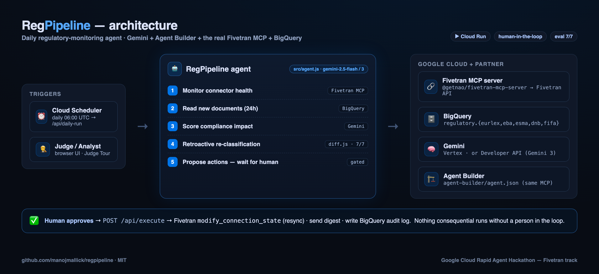
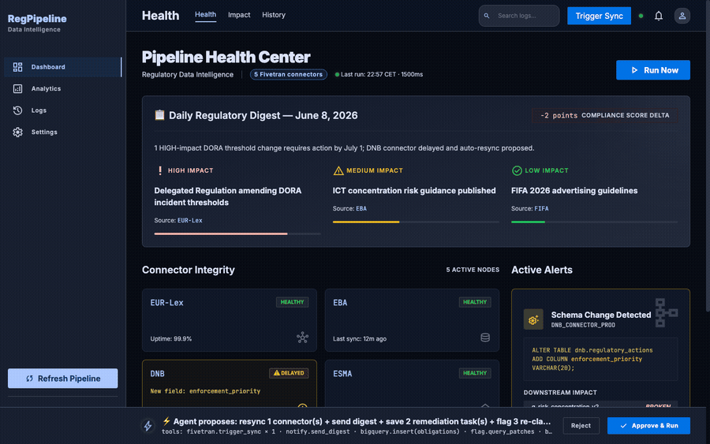

# RegPipeline — Daily Regulatory Monitoring Agent

[](https://regpipeline-908307939543.us-central1.run.app)
[](LICENSE)
[](src/agent.js)
[](src/fivetran-mcp.js)
[](agent-builder/agent.json)
[](src/bigquery.js)
[](package.json)
[](evals/live-proof.json)
[](evals/report.json)

**▶️ Live app:** https://regpipeline-908307939543.us-central1.run.app  ·  **Health JSON:** [`/health`](https://regpipeline-908307939543.us-central1.run.app/health)  ·  **Repo:** https://github.com/manojmallick/regpipeline

> 🧭 **Judges:** open the live app and click **“Judge Tour”** (top-right) for a 60-second guided walkthrough.

Fivetran syncs 5 regulatory sources (EUR-Lex, EBA, ESMA, DNB, FIFA) into BigQuery →
each morning RegPipeline checks connector health, reads the newly-synced documents,
scores their compliance impact with Gemini, drafts a daily digest, and — **with your
approval** — resyncs any delayed connectors and sends the digest. Zero manual monitoring
hours; new regulations surfaced within 6h instead of days.





> **3-min demo script, impact math, and live-proof steps → [DEMO.md](DEMO.md).**
> Try it now with zero setup: `npm install && npm run demo` → http://localhost:8080

**Stack (Google Cloud Rapid Agent Hackathon — Fivetran bucket):**
- 🧠 **Gemini 3** — regulatory impact analysis *(required)* — `@google/genai`, called in [`src/agent.js`](src/agent.js)
- 🏗️ **Google Cloud Agent Builder** — agent orchestration *(required)* — [`agent-builder/agent.json`](agent-builder/agent.json)
- 🔗 **Fivetran MCP** — partner superpower *(required)* — the **real** `@getnao/fivetran-mcp-server`,
  spawned and called at runtime in [`src/fivetran-mcp.js`](src/fivetran-mcp.js) when `FIVETRAN_USE_MCP=true`
- 🗄️ BigQuery (warehouse) · ☁️ Cloud Run + Cloud Scheduler (daily trigger)

> Working scaffold, not a finished product. Same agent loop, approval gate, `/health` proof,
> plus a Cloud Scheduler daily trigger. **Tested:** MOCK demo flow end-to-end; the real Fivetran
> MCP server (`@getnao/fivetran-mcp-server`) **handshake + tool discovery at runtime** (`partner_mcp_connected:true`).
> **`[TESTED: NO]`** only for the live data round-trip (MCP tool calls + BigQuery) — needs real
> Fivetran/GCP creds. Adjust table/column names in `src/bigquery.js` to match your destination schema.

## Architecture
```
Cloud Scheduler (06:00 UTC) ──GET /api/daily-run──► agent (src/agent.js)
Browser (public/index.html) ──GET /api/daily-run──►   1. connector health → Fivetran MCP
                                                       2. new documents    → BigQuery (regulatory.*)
                                                       3. impact scoring   → Gemini 3 (digest)
                                                       4. detect resync + query patches
                                                       5. PROPOSE resync+send ─┐ (gated)
ApprovalBar (human approves) ──POST /api/execute──►   fivetran.trigger_sync + send digest
```
The **judged** agent is [`agent-builder/agent.json`](agent-builder/agent.json)
(Gemini 3 + the real `@getnao/fivetran-mcp-server`, resyncs require approval). The Express app
invokes the **same** MCP server at runtime via [`src/fivetran-mcp.js`](src/fivetran-mcp.js)
when `FIVETRAN_USE_MCP=true` (REST is the fallback) — so the partner MCP is genuinely called,
not just named.

## Two agents
- **PipelineMonitor** — lists connectors, flags delayed/broken + schema changes, reads new docs from BigQuery.
- **RegulatoryAnalyst** — scores each doc HIGH/MEDIUM/LOW, names affected articles + actions, proposes the resync + digest.

## Demo mode (no credentials — for judges / rehearsal)
```bash
npm install
npm run demo            # MOCK=true → http://localhost:8080
```
Opens the **Pipeline Health Center** dashboard with three live views — **Health**
(daily digest + connector integrity + schema-change alert), **Impact** (Gemini 3
threshold-diff analysis + retroactive re-classification + action items), and **History**
(per-connector sync telemetry). Click **Run Now** to run the agent pass and watch the
human-approval bar gate the resync/digest. Fully interactive on canned data — zero setup.

## Quick start (live)
```bash
cp .env.example .env     # GCP project + FIVETRAN_API_KEY/SECRET + BQ_DATASET
npm install
gcloud auth application-default login && gcloud config set project "$GOOGLE_CLOUD_PROJECT"
npm run dev              # http://localhost:8080 → click "Run Now"
```

## Deploy to Cloud Run + daily schedule
```bash
gcloud run deploy regpipeline \
  --source . \
  --region=europe-west1 \
  --allow-unauthenticated \
  --set-secrets="FIVETRAN_API_KEY=regpipeline-ft-key:latest,FIVETRAN_API_SECRET=regpipeline-ft-secret:latest" \
  --set-env-vars="GOOGLE_GENAI_USE_VERTEXAI=true,GEMINI_MODEL=gemini-2.5-flash,GOOGLE_CLOUD_PROJECT=<your-project>,GOOGLE_CLOUD_LOCATION=us-central1,BQ_DATASET=regulatory,FIVETRAN_USE_MCP=true"
# Note: set GEMINI_MODEL=gemini-3 only where your Vertex project serves it; otherwise gemini-2.5-flash.
# GOOGLE_CLOUD_PROJECT is required for the Vertex Gemini client on Cloud Run (BigQuery auto-detects it).

# Daily 08:00 CET trigger
gcloud scheduler jobs create http regpipeline-daily \
  --schedule="0 6 * * *" \
  --uri="https://<CLOUD_RUN_URL>/api/daily-run" \
  --time-zone="Europe/Amsterdam"
```

## Health check (proof for judges)
```bash
curl https://<your-cloud-run-url>/health
# { "status":"ok", "mode":"live", "model":"gemini-3", "partner":"fivetran",
#   "partner_transport":"mcp", "partner_connected":true,
#   "partner_mcp_connected":true, "bigquery_connected":true, ... }
# partner_mcp_connected is true ONLY after a real MCP handshake (connect + tools/list)
# against @getnao/fivetran-mcp-server; in REST/demo mode it is honestly false.
```

### Automated live smoke test
With the server running in **live** mode (real GCP/Fivetran creds), one command verifies the
whole stack — Gemini model, Fivetran MCP, BigQuery, and a real gated `daily-run` — and writes
a timestamped `evals/live-proof.json` you can attach to the submission:
```bash
npm run smoke                              # against http://localhost:8080
BASE=https://<cloud-run-url> npm run smoke # against Cloud Run
```

## Project docs
| Doc | What |
|---|---|
| [ARCHITECTURE.md](ARCHITECTURE.md) | Components, request flow, the MCP runtime path, deployment (+ `architecture.png`) |
| [DESIGN_SYSTEM.md](DESIGN_SYSTEM.md) | Color, type, spacing, components, motion |
| [DECK.pdf](DECK.pdf) · [DECK.md](DECK.md) | 8-slide pitch deck |
| [DEVPOST.md](DEVPOST.md) | Paste-ready Devpost submission copy |
| [VIDEO_SCRIPT.md](VIDEO_SCRIPT.md) | Word-for-word 3-min demo narration |
| [SCREENSHOTS.md](SCREENSHOTS.md) | Gallery plan + captions (`screenshots/`) |
| [SUBMISSION.md](SUBMISSION.md) | Checklist runbook |
| [DEMO.md](DEMO.md) | Live demo script + impact math |

## License
MIT — see [LICENSE](LICENSE).
